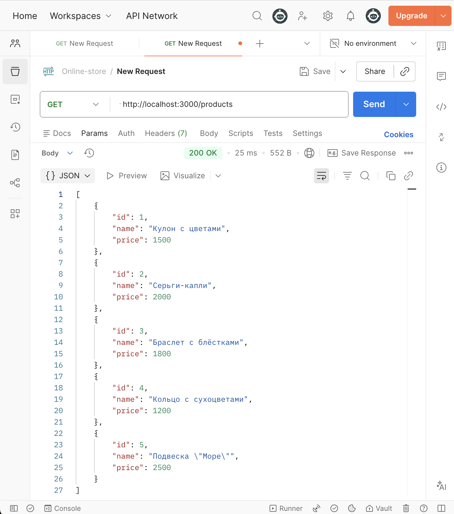
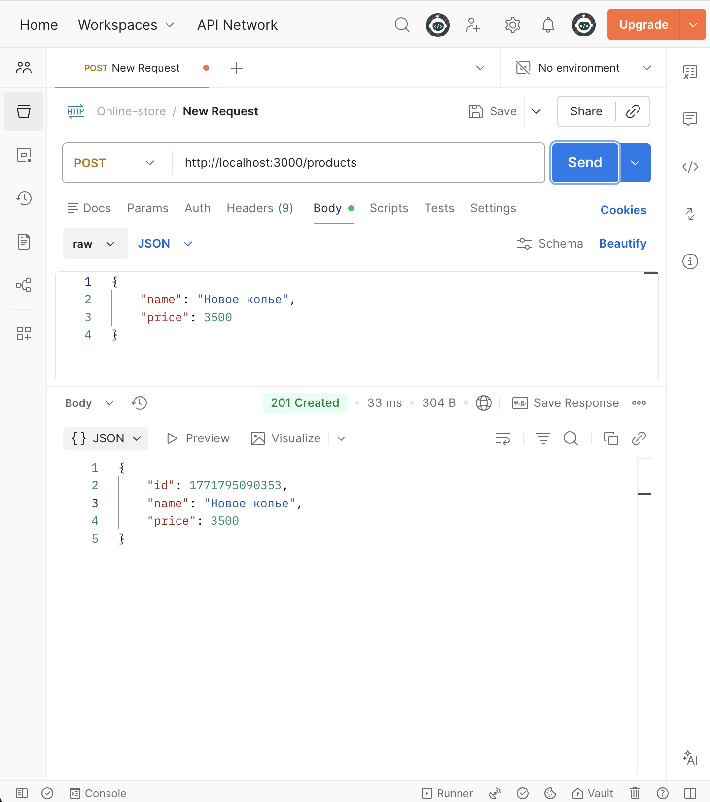
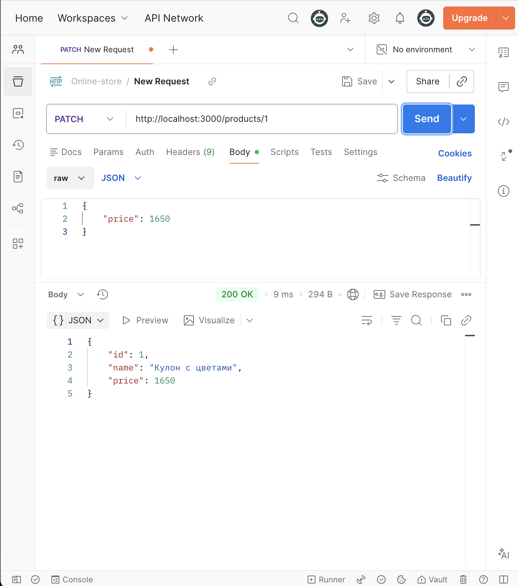
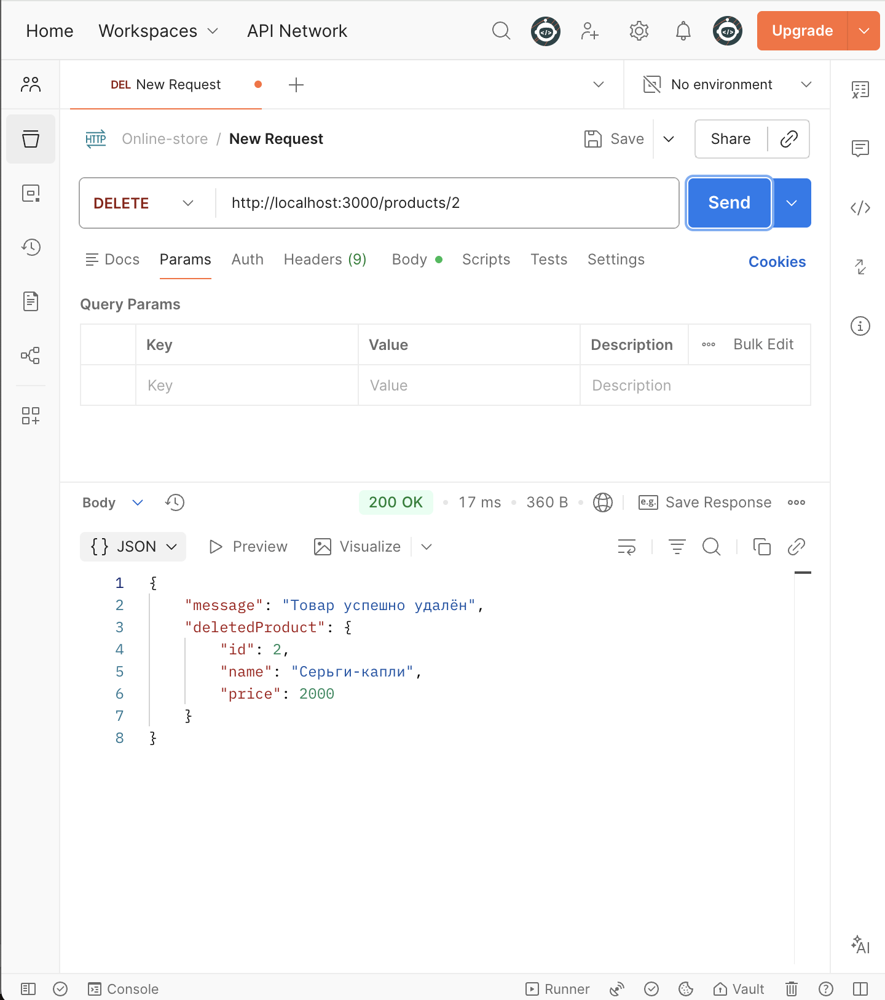
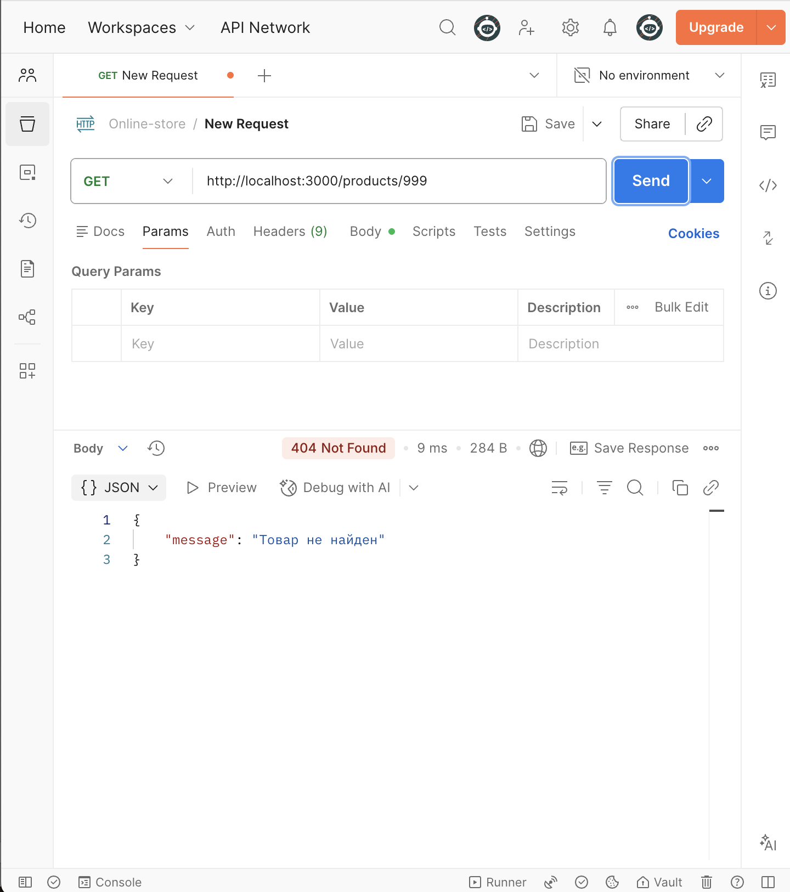
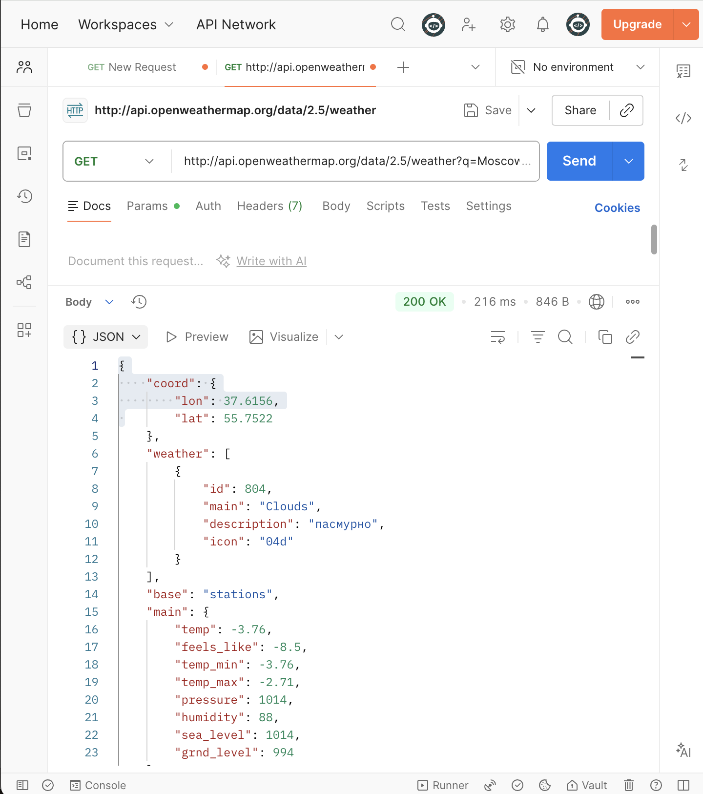
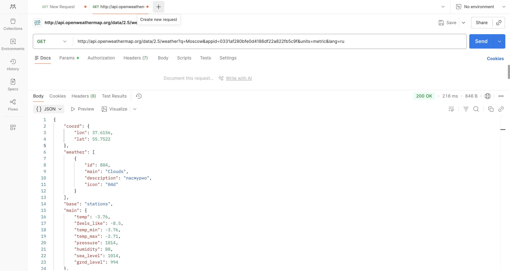
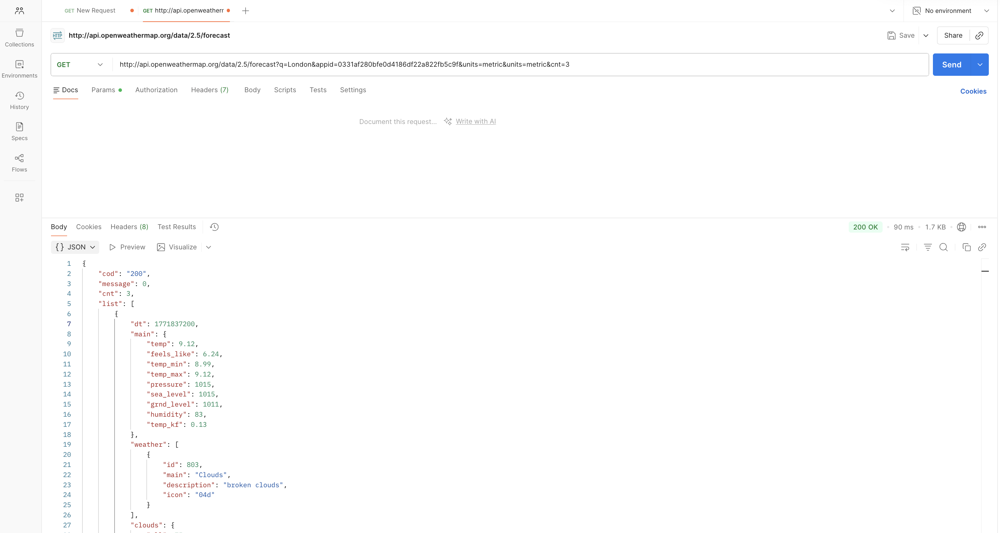
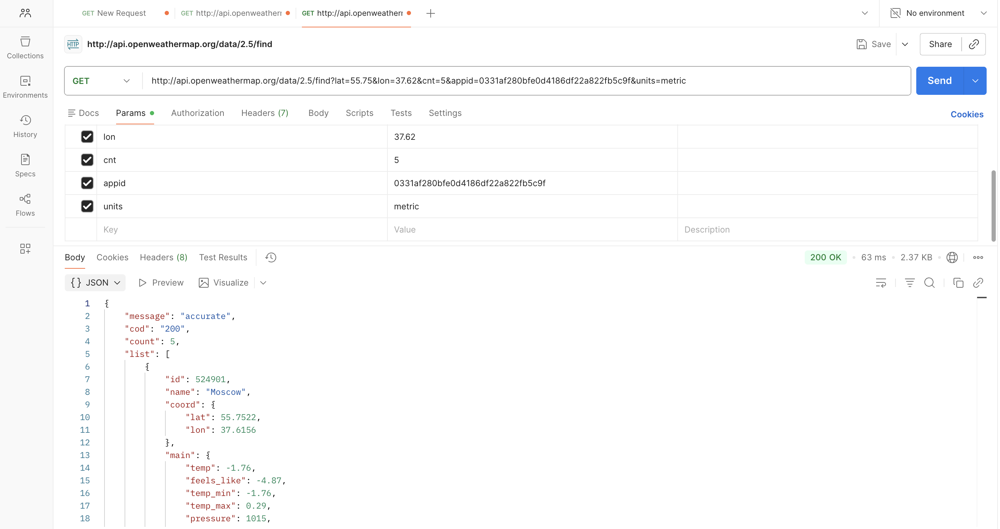
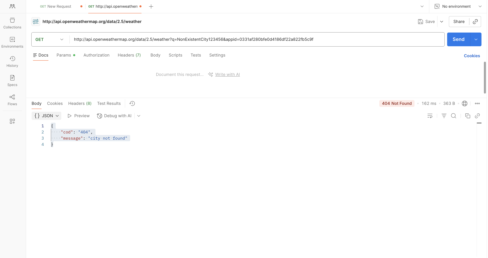

# Практическое задание: Тестирование API


## Описание
В данной работе мной протестировано два API:
1. **Собственное REST API**, разработанное на Express.js (магазин украшений).
2. **Стороннее API** - OpenWeatherMap (сервис погоды).

## Инструменты
- **Postman** - для отправки HTTP-запросов и анализа ответов.
- **Node.js / Express** - для запуска локального сервера.

## Результаты тестирования
Все скриншоты с результатами запросов находятся в папке [screenshots/](screenshots/).

### Собственное API (localhost:3000)
1. **GET /products** - получение всех товаров.
2. **POST /products** - добавление нового товара.
3. **PATCH /products/1** - обновление цены товара.
4. **DELETE /products/2** - удаление товара.
5. **GET /products/999** - проверка обработки ошибки (404).

### OpenWeatherMap API
1. **GET weather?q=Moscow** - погода в Москве.
2. **GET weather?lat=55.75&lon=37.62** - погода по координатам.
3. **GET forecast?q=London** - прогноз погоды в Лондоне.
4. **GET group?id=524901,498817** - метеостанции вокруг географической точки.
5. **GET weather?q=NonExistentCity** - проверка ошибки при неверном запросе.

---


### Выполненные запросы

#### Запрос №1: GET /products — получение всех товаров
- **Метод:** `GET`
- **URL:** `http://localhost:3000/products`
- **Результат:** Успешно получен список всех товаров (код `200 OK`).


*На скриншоте виден список из 5 товаров в теле ответа.*

#### Запрос №2: POST /products — добавление нового товара
- **Метод:** `POST`
- **URL:** `http://localhost:3000/products`
- **Body (raw JSON):**
  ```json
  {
      "name": "Колье 'Изумруд'",
      "price": 3500
  }
  ```
- **Результат:** Товар успешно создан (код `201 Created`). В ответе приходит созданный объект с уникальным ID.


*На скриншоте виден отправленный JSON и ответ сервера с новым товаром.*

#### Запрос №3: PATCH /products/1 — обновление цены товара
- **Метод:** `PATCH`
- **URL:** `http://localhost:3000/products/1`
- **Body (raw JSON):**
  ```json
  {
      "price": 1650
  }
  ```
- **Результат:** Цена товара успешно обновлена (код `200 OK`).


*На скриншоте видно, что цена товара изменилась с 1500 на 1650.*

#### Запрос №4: DELETE /products/2 — удаление товара
- **Метод:** `DELETE`
- **URL:** `http://localhost:3000/products/2`
- **Результат:** Товар успешно удален (код `200 OK`) с сообщением об успехе.


*На скриншоте видно сообщение "Товар успешно удалён".*

#### Запрос №5: GET /products/999 — проверка обработки ошибки
- **Метод:** `GET`
- **URL:** `http://localhost:3000/products/999`
- **Результат:** Сервер вернул ошибку `404 Not Found` с сообщением "Товар не найден".


*На скриншоте виден статус 404 и сообщение об ошибке.*

---

## Часть 2. Работа со сторонним API (OpenWeatherMap)

**Выбранное API:** [OpenWeatherMap](https://openweathermap.org/) (текущая погода)  
**Документация:** [https://openweathermap.org/current](https://openweathermap.org/current)  
**API-ключ:** `990d0eaab72654910fc42bdc0f04b91d` (действующий ключ)

### Выполненные запросы

#### Запрос №1: Текущая погода по названию города (Москва)
- **Метод:** `GET`
- **URL:** `http://api.openweathermap.org/data/2.5/weather?q=Moscow&appid=990d0eaab72654910fc42bdc0f04b91d&units=metric&lang=ru`
- **Результат:** JSON с данными о погоде в Москве (температура, влажность, давление и т.д.).



#### Запрос №2: Погода по географическим координатам
- **Метод:** `GET`
- **URL:** `http://api.openweathermap.org/data/2.5/weather?lat=55.75&lon=37.62&appid=990d0eaab72654910fc42bdc0f04b91d&units=metric`
- **Результат:** JSON с погодой для координат Москвы.



#### Запрос №3: Прогноз погоды на 5 дней (Лондон)
- **Метод:** `GET`
- **URL:** `http://api.openweathermap.org/data/2.5/forecast?q=London&appid=990d0eaab72654910fc42bdc0f04b91d&units=metric&lang=ru&cnt=5`
- **Результат:** JSON с прогнозом на 5 дней с интервалом 3 часа.



#### Запрос №4: Данные с метеостанций вокруг географической точки
- **Метод:** `GET` (несколько запросов)
- **URL:** http://api.openweathermap.org/data/2.5/find?lat=55.75&lon=37.62&cnt=5&appid=990d0eaab72654910fc42bdc0f04b91d&units=metric
- **Описание**: Запрос ищет метеостанции в окрестностях указанных координат (Москва) и возвращает данные с cnt=5 ближайших станций . Ответ будет содержать массив list с данными от разных станций.



#### Запрос №5: Поиск города с некорректным названием (обработка ошибки)
- **Метод:** `GET`
- **URL:** `http://api.openweathermap.org/data/2.5/weather?q=NonExistentCity123456&appid=990d0eaab72654910fc42bdc0f04b91d`
- **Результат:** Ответ с HTTP-статусом `404 Not Found` и сообщением `{"cod":"404","message":"city not found"}`.



---

## Выводы

В ходе выполнения практического задания были получены следующие навыки:
- Разработка и тестирование собственного REST API с использованием Express.js.
- Работа с различными HTTP-методами (GET, POST, PATCH, DELETE).
- Обработка ошибок и корректных HTTP-статусов.
- Интеграция и тестирование стороннего API (OpenWeatherMap).
- Работа с Postman для отправки запросов и анализа ответов.
- Оформление технической документации в формате Markdown.

**Все запросы выполнены успешно, скриншоты прилагаются.**
